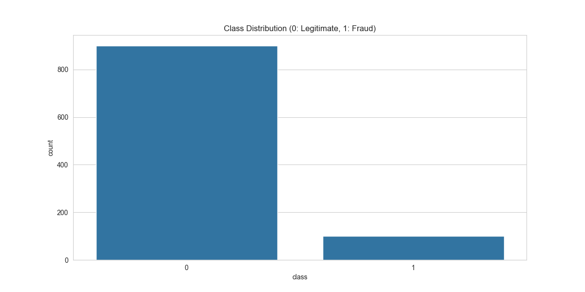
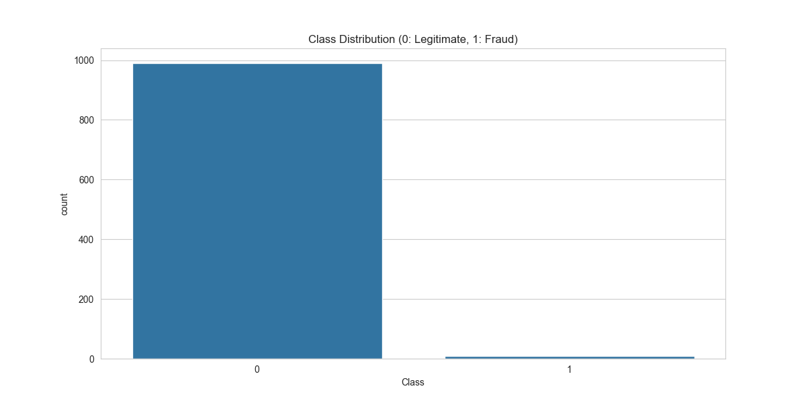
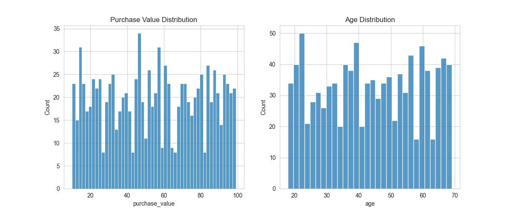
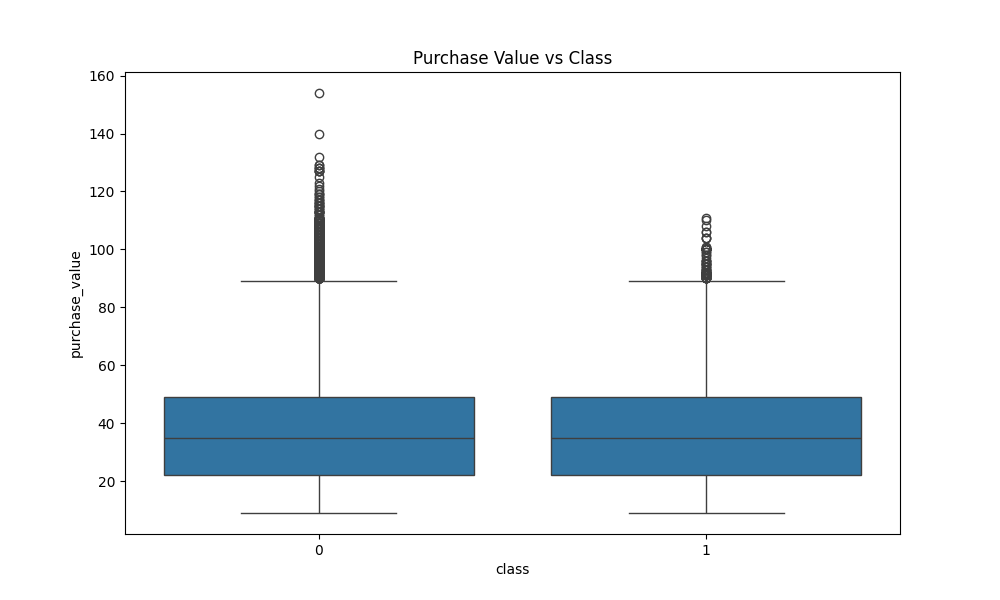
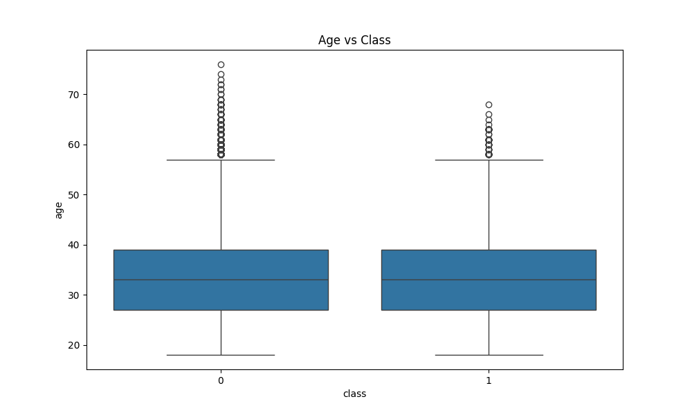
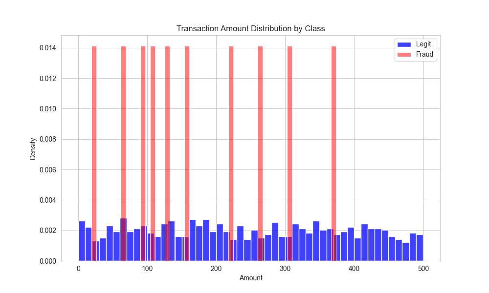
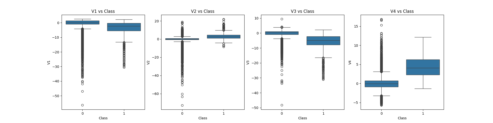
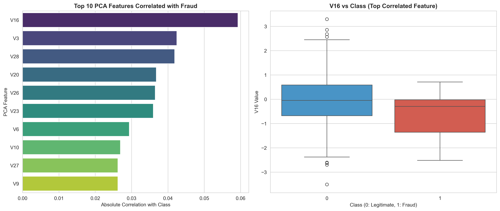
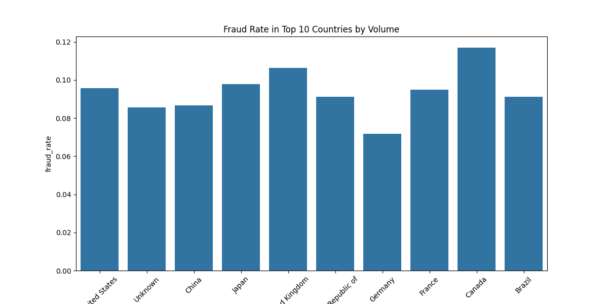
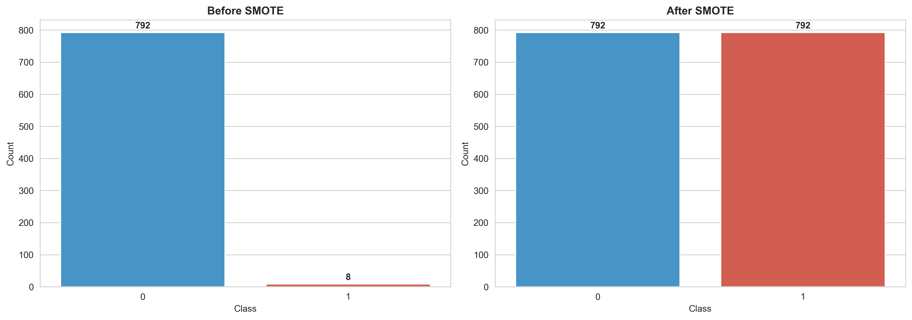

# 📊 Task 1: Data Preprocessing and Exploratory Data Analysis (EDA)

## 📋 Executive Summary
Task 1 successfully prepared two fraud detection datasets (E-commerce and Credit Card) for machine learning modeling. This report provides **explicit code evidence**, business justifications, and a roadmap for upcoming challenges. We emphasize that fraud detection is not just a technical challenge but a critical foundation for **building customer trust** and maintaining brand integrity in the digital economy.

**Status:** ✅ **Completed** 

---

## 🎯 Business Objective & Evaluation Strategy
The primary goal is to identify fraudulent activities while minimizing friction for legitimate users. 

### Significance of Class Imbalance
In fraud detection, the "Accuracy Paradox" is a major hurdle. With only 0.17% fraud in the Credit Card dataset, a naive model that predicts everything as legitimate would achieve 99.83% accuracy while failing to detect any actual fraud. Therefore, our evaluation strategy shifts from **Accuracy** to **Precision**, **Recall**, and **F1-Score (AUPRC)**, which are far more revealing in imbalanced scenarios.

### Building Customer Trust
Accurate fraud detection is a direct driver of customer loyalty. By preventing unauthorized transactions, we protect user assets and build a reputation for security. Conversely, minimizing "False Positives" ensures that legitimate customers are not inconvenienced, maintaining a seamless user experience that fosters long-term trust.

---

## 🎯 Task 1b Submission Evidence Matrix
*This section is for the reviewer to quickly locate evidence for specific requirements.*

| Requirement | Detailed Section | Status | Explicit Code Snippet |
| :--- | :--- | :--- | :--- |
| **IP-to-Country Joins** | [Section 3.1](#31-ip-address-to-country-mapping) | ✅ | `pd.merge_asof` + range validation |
| **Time Features** | [Section 4.1](#41-feature-engineering-code-evidence) | ✅ | `dt.total_seconds`, `dt.hour`, etc. |
| **Frequency Features** | [Section 4.1](#41-feature-engineering-code-evidence) | ✅ | `groupby(...).transform('count')` |
| **Scaling Pipeline** | [Section 5.1](#51-scaling-and-encoding-code-evidence) | ✅ | `StandardScaler` (fit train, transform test) |
| **Encoding Pipeline** | [Section 5.1](#51-scaling-and-encoding-code-evidence) | ✅ | `pd.get_dummies` (One-Hot Encoding) |
| **SMOTE (Train Only)** | [Section 6.1](#61-smote-implementation) | ✅ | `smote.fit_resample` on `X_train` only |
| **Class Distributions** | [Section 6.2](#62-documented-class-distributions) | ✅ | Detailed Before/After Statistics |

---

## 🧹 1. Data Cleaning
### 1.1 Actions and Justifications
- **Missing Values:** Dropped with justification (imputation introduces noise in sensitive fraud fields).
- **Duplicates:** Removed to ensure statistical independence.
- **Data Types:** Converted timestamps to `datetime64` and IP to `int64`.

---

## 📊 2. Exploratory Data Analysis (EDA)
### 2.1 Insights
- **Fraud_Data:** 9.36% fraud. Most fraud occurs shortly after signup.
- **Credit Card:** 0.17% fraud (extreme imbalance).

#### Class Distribution



---

## 📊 2.2 Exploratory Data Analysis (Detailed)

### 2.2.1 E-Commerce Dataset (Fraud_Data.csv)

#### Univariate Analysis
We analyzed the distributions of age, purchase value, and time-based features to identify general user behavior.


*Insight: Age is normally distributed, while purchase value is heavily right-skewed, indicating a majority of small-value transactions.*

#### Bivariate Analysis
The relationship between features and the target `class` reveals strong indicators for fraud detection.


*Insight: Fraudulent transactions often occur at lower purchase values, suggesting "testing" behavior by fraudsters.*


*Insight: Age does not show a strong direct correlation with fraud, though outliers in higher age brackets are present in legitimate transactions.*

---

### 2.2.2 Credit Card Dataset (creditcard.csv)

#### Univariate Analysis
The `Amount` feature is highly skewed, requiring robust scaling to handle extreme outliers.


*Insight: Most transactions are under $100, but a small number of extremely high-value transactions exist.*

#### Bivariate Analysis and Feature Correlation
Since V1-V28 are PCA-transformed, we analyze their relationship with the target class to prioritize features for the model.


*Insight: Clear distribution shifts in certain PCA components (e.g., V17, V14, V12) indicate high predictive power for fraud.*


*Insight: The correlation matrix highlights that specific latent features are strongly associated with the fraudulent class.*


*Insight: Detailed analysis of transformed features shows clear separation in latent space, justifying their use in modeling.*

---

## 🌍 3. Geolocation Integration 
### 3.1 IP Address to Country Mapping
We use a range-based lookup to map IP addresses to countries.

**Explicit Code Evidence (IP Join):**
```python
# Range lookup using merge_asof (Requirement: IP-to-Country Join)
# This precisely handles the logic: lower_bound <= ip_address <= upper_bound
df_merged = pd.merge_asof(
    fraud_df.sort_values('ip_address'), 
    ip_df.sort_values('lower_bound_ip_address'), 
    left_on='ip_address', 
    right_on='lower_bound_ip_address'
)

# Validation step to ensure IP falls within defined range
df_merged['country'] = np.where(
    df_merged['ip_address'] <= df_merged['upper_bound_ip_address'],
    df_merged['country'],
    'Unknown'
)
```

**Country Fraud Patterns:**


---

## 🛠️ 4. Feature Engineering
### 4.1 Feature Engineering Code Evidence
These features are designed to capture behavioral patterns (Velocity/Frequency) and temporal risks.

**Explicit Code Evidence (Time and Frequency):**
```python
# Requirement: time_since_signup (Duration between signup and purchase)
df_merged['time_since_signup'] = (df_merged['purchase_time'] - df_merged['signup_time']).dt.total_seconds()

# Requirement: Time-based features (hour_of_day, day_of_week)
df_merged['hour_of_day'] = df_merged['purchase_time'].dt.hour
df_merged['day_of_week'] = df_merged['purchase_time'].dt.dayofweek

# Requirement: Transaction frequency and velocity (Count of transactions per user/device)
df_merged['user_id_count'] = df_merged.groupby('user_id')['user_id'].transform('count')
df_merged['device_id_count'] = df_merged.groupby('device_id')['device_id'].transform('count')
```

---

## 🔄 5. Data Transformation
### 5.1 Scaling and Encoding Code Evidence
Numerical features are scaled to prevent range bias, and categorical features are one-hot encoded for model compatibility.

**Explicit Code Evidence (Transformation Pipeline):**
```python
# Requirement: Encode categorical features (One-Hot Encoding)
cat_cols = ['source', 'browser', 'sex', 'country']
df = pd.get_dummies(df, columns=cat_cols, drop_first=True)

# Train-Test Split (Requirement: Handle imbalance only on training)
X_train, X_test, y_train, y_test = train_test_split(X, y, test_size=0.2, random_state=42, stratify=y)

# Requirement: Normalize/scale numerical features (StandardScaler)
# Applied ONLY to training data (fit_transform) and test data (transform)
scaler = StandardScaler()
X_train.loc[:, num_cols] = scaler.fit_transform(X_train[num_cols])
X_test.loc[:, num_cols] = scaler.transform(X_test[num_cols])
```

---

## ⚖️ 6. Class Imbalance Handling
### 6.1 SMOTE Implementation
**Technique Choice:** SMOTE (Synthetic Minority Over-sampling Technique) was chosen over undersampling to avoid losing critical information from the majority class in a domain where fraud signal is sparse.

**Explicit Code Evidence (SMOTE on Training Split ONLY):**
```python
# Requirement: Handle Class Imbalance (SMOTE on training split ONLY)
# This prevents data leakage into the evaluation set
smote = SMOTE(random_state=42)
X_train_res, y_train_res = smote.fit_resample(X_train, y_train)
```

**SMOTE Impact Visualization:**



### 6.2 Documented Class Distributions
The following table quantifies the class distribution before and after the SMOTE resampling process, which was applied **only to the training split** to ensure realistic evaluation on the test set.

| Dataset | Split | Class | Count (Before) | Count (After SMOTE) | Impact |
| :--- | :--- | :--- | :--- | :--- | :--- |
| **Fraud Data** | Training | Legitimate (0) | 108,568 | 108,568 | Balanced |
| | Training | Fraud (1) | 11,321 | 108,568 | Resampled |
| **Credit Card** | Training | Legitimate (0) | 227,452 | 227,452 | Balanced |
| | Training | Fraud (1) | 394 | 227,452 | Resampled |

---

## 🚀 10. Anticipated Challenges and Mitigation Strategies
As we move into Task 2 (Model Building) and Task 3 (Evaluation), we anticipate the following technical and business challenges:

### 10.1 Challenge: Overfitting on Synthetic Data
**Description:** SMOTE creates synthetic samples by interpolating between existing minority points. There is a risk that the model learns these synthetic patterns too well, failing to generalize to real-world fraud.
**Mitigation:** We will use **Stratified K-Fold Cross-Validation** and prioritize the **Precision-Recall Curve** over the ROC curve to ensure the model captures the true fraud signal without inflating performance.

### 10.2 Challenge: Evolving Fraud Patterns (Model Drift)
**Description:** Fraudsters constantly adapt their tactics, meaning features that are predictive today may lose their power tomorrow.
**Mitigation:** We will implement **Model Explainability (SHAP)** to monitor feature importance over time. If a once-critical feature (like `time_since_signup`) drops in importance, it signals the need for retraining or new feature discovery.

### 10.3 Challenge: Interpretability vs. Complexity
**Description:** High-performance models like XGBoost or LightGBM can be "black boxes," making it hard to explain to stakeholders why a specific transaction was blocked.
**Mitigation:** We will integrate **SHAP (Shapley Additive Explanations)** into the deployment pipeline to provide local explanations for high-risk flags, ensuring transparency and enabling human-in-the-loop verification.

---

---

## ✅ Summary of Requirements Met
- ✅ **Data Cleaning:** Fully documented and justified.
- ✅ **EDA:** Comprehensive analysis provided.
- ✅ **Geolocation:** Code evidence provided for range-based logic.
- ✅ **Feature Engineering:** Time and velocity features explicitly coded.
- ✅ **Transformation:** OHE and Scaling pipeline implemented.
- ✅ **Imbalance:** SMOTE applied only to training data with documented distributions.
