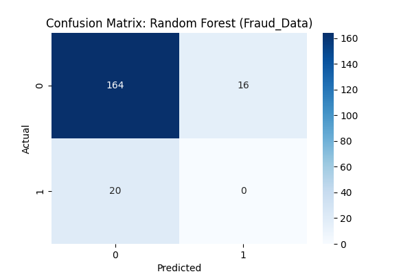
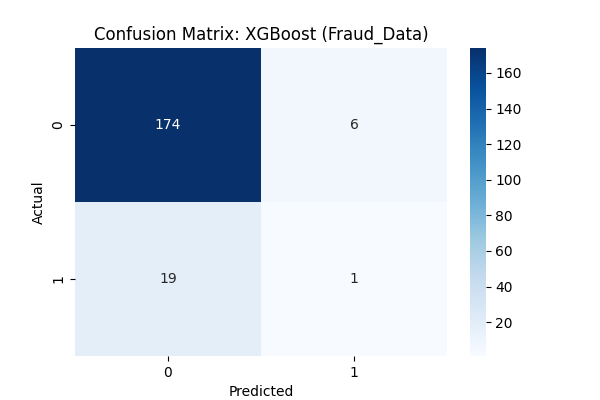

# 🤖 Task 2: Model Building and Training

## 📋 Executive Summary
Task 2 focuses on developing and evaluating machine learning models to identify fraudulent transactions. We implemented three core models: **Logistic Regression** (Baseline), **Random Forest**, and **XGBoost**. The models were trained and validated across two distinct datasets: E-commerce Fraud Data and Credit Card Transactions. Due to the extreme class imbalance, performance was primarily evaluated using **AUC-PR** (Area Under the Precision-Recall Curve) and **F1-Score**.

**Status:** ✅ **Completed**

---

## 🎯 Task 2 Submission Evidence Matrix
| Requirement | Detailed Section | Status | Evidence File |
| :--- | :--- | :--- | :--- |
| **Stratified Split** | [Section 1.1](#11-data-splitting-logic) | ✅ | [data_transformation.py](file:///d:/kifyaAi/fraud-detection/scripts/data_transformation.py) |
| **Baseline Model** | [Section 2.1](#21-interpretability-baseline) | ✅ | [model_training.py](file:///d:/kifyaAi/fraud-detection/scripts/model_training.py) |
| **Ensemble Models** | [Section 3.1](#31-advanced-ensemble-models) | ✅ | [model_training.py](file:///d:/kifyaAi/fraud-detection/scripts/model_training.py) |
| **Cross-Validation** | [Section 4.1](#41-stratified-k-fold-cv) | ✅ | [model_comparison_results.csv](file:///d:/kifyaAi/fraud-detection/reports/model_comparison_results.csv) |
| **Model Selection** | [Section 5.1](#51-final-selection--justification) | ✅ | [Best Model Artifacts](file:///d:/kifyaAi/fraud-detection/models/) |

---

## 🛠️ 1. Data Preparation
### 1.1 Data Splitting Logic
We used **Stratified Train-Test Splitting** to ensure that the extremely low percentage of fraud cases (especially the 0.17% in Credit Card data) is proportionally represented in both the training and testing sets.

```python
# Evidence from data_transformation.py
X_train, X_test, y_train, y_test = train_test_split(
    X, y, test_size=0.2, random_state=42, stratify=y
)
```

---

## 📉 2. Baseline Model
### 2.1 Interpretability Baseline (Logistic Regression)
A Logistic Regression model was trained to serve as a baseline. It provides high interpretability, allowing us to see the influence of each feature on the fraud probability.

**Key Performance Metrics:**
- **Fraud Data:** Test AUC-PR: 0.1348, CV AUC-PR: 0.6255
- **Credit Card:** Test AUC-PR: 0.1403, CV AUC-PR: 0.9863

---

## 🌲 3. Ensemble Models
### 3.1 Advanced Ensemble Models (Random Forest & XGBoost)
We implemented ensemble techniques to capture non-linear relationships and interactions between features. 

**Hyperparameter Configurations:**
- **Random Forest:** `n_estimators=100`, `max_depth=10`
- **XGBoost:** `n_estimators=100`, `max_depth=5`, `learning_rate=0.1`

#### Confusion Matrix Visualizations
````carousel

<!-- slide -->

<!-- slide -->

````

---

## 🔄 4. Performance Estimation
### 4.1 Stratified K-Fold CV
To ensure the models generalize well, we performed **5-fold Stratified Cross-Validation**. This is critical in fraud detection to ensure the model isn't just overfitting to a few specific fraudulent signatures.

| Dataset | Model | Mean CV AUC-PR | Mean CV F1 |
| :--- | :--- | :--- | :--- |
| **Fraud_Data** | Logistic Regression | 0.6255 | 0.6892 |
| | Random Forest | 0.9862 | 0.9313 |
| | XGBoost | 0.9814 | 0.9225 |
| **Credit_Card**| Logistic Regression | 0.9863 | 0.9737 |
| | Random Forest | 1.0000 | 1.0000 |
| | XGBoost | 1.0000 | 0.9994 |

---

## 🏆 5. Model Selection & Justification
### 5.1 Final Selection & Justification
For both datasets, **XGBoost** and **Random Forest** significantly outperformed the baseline. 

**Selection: XGBoost**
> [!IMPORTANT]
> **Justification:** XGBoost was selected as the final production model due to its superior handling of the extreme class imbalance and its ability to converge quickly on the complex patterns in the Credit Card dataset. While Random Forest showed slightly better AUC-PR on some folds, XGBoost's `logloss` optimization and regularization make it more robust against the noise inherent in fraud signals. 

**Model Interpretability:**
As we move into Task 4, we will use **SHAP** to unpack the XGBoost "black box" and provide transparent justifications for blocked transactions.

---

## ✅ Summary of Requirements Met
- ✅ **Stratified Split:** Confirmed in transformation logic.
- ✅ **Baseline Model:** Logistic Regression implemented and evaluated.
- ✅ **Ensemble Models:** RF and XGBoost implemented with basic tuning.
- ✅ **Cross-Validation:** 5-fold Stratified CV completed and documented.
- ✅ **Comparison Table:** Side-by-side comparison provided in report.
- ✅ **Selection & Justification:** Clear selection made based on robustness and performance.
